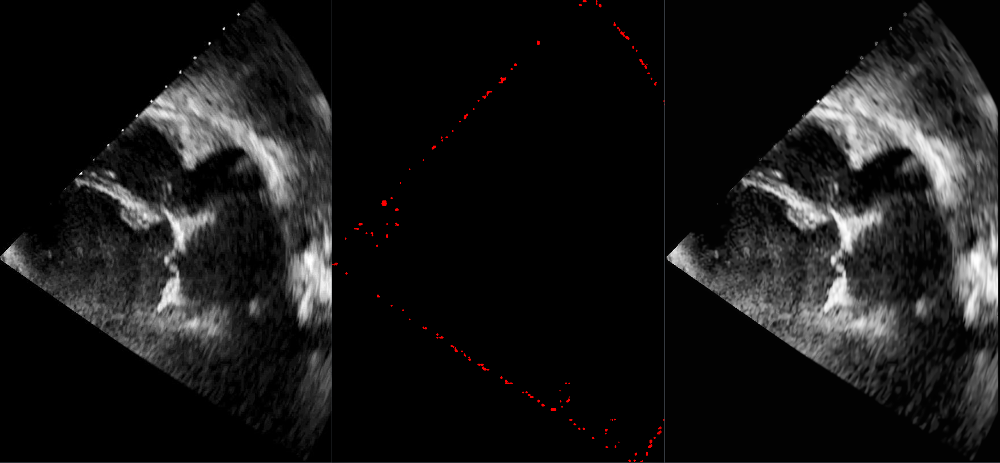
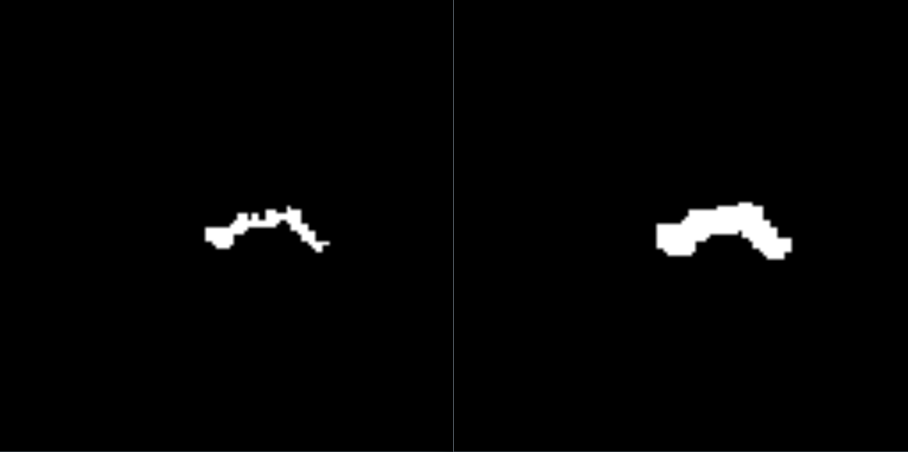
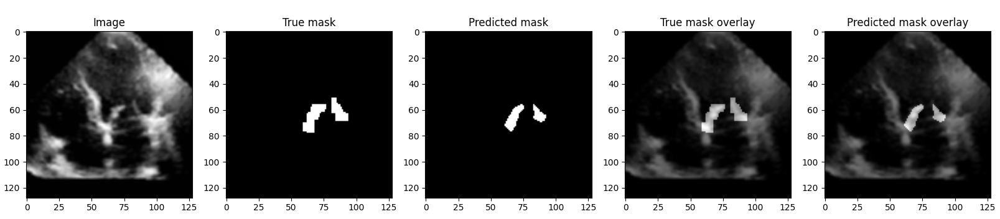

# Mitral Valve Segmentation

## Introduction
This repository contains updated code for what was originally developed for the 3rd task in the 2021 ETH Advanced Machine Learning course.  

## About the task
The task was to segment the mitral valve from 2D echocardiography videos of 65 patients. Each video includes exactly 3 annotated frames. There are two types of datasets: 
- **expert**: 20 patients with high resolution, high quality annotations provided by experts. Each video has a different length and resolution.
- **amateur**: 45 patients with low resolution annotations provided by amateurs

In addition, each patient data point contains an annotation bounding box for the mitral valve. This was not used in the final model because the amateur annotations were found to not reside completely in the bounding box.

The data is not released here as it came from a private dataset.
### Structure

The repository is structured as follows

```angular2html
.
├── app
├── checkpoints
│   └── drunet
│       └── Model for denoising images.
├── data
│   ├── sample.pkl
├── figures
├── src
│   ├── Different python scripts for running the UNet model for image segmentation.
├── testing
│   ├── Directory where we tested data preprocessing and augmentation techniques.
└── train.py

```

## Preprocessing

The ultrasound images we were given contain measurement noise from apparatus which is even more pronounced in the amateur dataset. 
This is exhibited by speckles in the ultrasound, and small white dots on the contours. In our analysis, we found that the neural
network tended to pick up this noise, especially because the segmentation mask is very small and not very contrasting. 

To remove this noise, we used a denoising model based on the [DRUnet](https://arxiv.org/pdf/2008.13751.pdf) architecture. We initially tried
multiple heuristics such as NLM, median filtering, and bilateral filtering, but found that the DRUnet model was the most effective. 
Lastly, we correct the contrast of the image by applying histogram equalization (CLAHE). To remove the white dots, we simply inpaint them using OpenCV's inpainting function.

The following image shows the effect of preprocessing on the ultrasound image, where left is the original image, middle is the contour of the detected healing areas, and right is the inpainted, denoised image.
<p align="center">

</p>
For the masks, initial analysis revealed the segmentations are not smooth, which hindered model prediction since the model would tend to predict smooth(er) masks.
To solve this, we applied thresholded Gaussian blurring, dilation and bilateral filtering. 

Repetitive alteration of the mask can lead to the segmentations of both masks to unify, or dilate so much that in the original image they grow beyond the valve. 
This can be problematic as the following picture shows: on the left is the original mask, and right is the preprocessed mask.

<p align="center">

</p>
Nevertheless, this modification was found to be beneficial for the model, increasing average IoU by ~0.05.

An issue we faced is that there existed great class imbalance which had to be addressed. The majority of the masks were empty due to the absence of the mitral valve in them. 
To combat this we employed bootstrapping amongst other methods to balance the labels. 

## Model

We are using a derivative of the [UNet](https://arxiv.org/pdf/1505.04597.pdf) model for biomedical image segmentation which has shown already great benchmark results.
The additions are given by the Skip Connections and the Squeeze Excite Block. More information can be found [here](https://paperswithcode.com/method/squeeze-and-excitation-block).
To quote the source "The Squeeze-and-Excitation Block is an architectural unit designed to improve the representational power of a network by enabling it to perform dynamic channel-wise feature recalibration".
The loss for our model is the Power Jaccard Loss which is described [here](https://www.scitepress.org/Papers/2021/103040/103040.pdf) in great detail.

We found that Squeeze Excite blocks really helped the model to focus and detect the mitral valve. The Power Jaccard Loss was also better than the Dice Loss because the segmentation masks are very sparse and highly imbalanced.

## Example of the predicted mask vs true mask
<p align="center">

</p>
